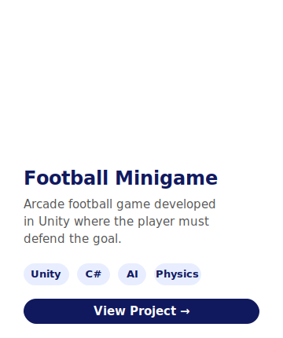
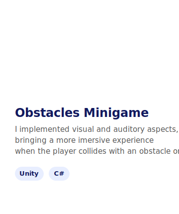
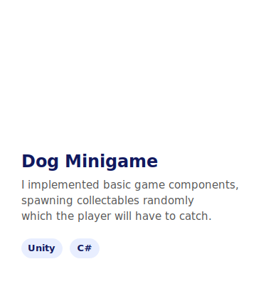

 
	

-----

<h3 align="center">Hey over there!, I'm Christian Ivan Cisneros - you can call me Chris if you want  </h3>
    
 

<!--./assets/documents/CisnerosRosalesChristianCV.pdf-->
 

	
<picture></picture> **About Me**

-----
<!--<picture> </picture>-->
<picture></picture>

	I'm Cisneros Christian Ivan, and I'm currently following my own path in the game development scene. I'm specialized in game mechanics coding, where I'm always trying to give the best experience to the users, 	having in mind the different opportunities a project has to make the experience more enjoyable. Likewise, I'm open-minded about learning new languages and technologies in order to improve my knowledge and be 	able to enroll in different areas. That's why I'm always looking for new people to work with; no matter if it is in a work enviroment or a competition, I appreciate any opportunity to learn from others and 		help each other to improve, sharing experiences, knowledge and meet more of each one and build up a community where we are always connected. 

 

<picture></picture> **Soft Skills** 

-----

<picture></picture>
I have a set of soft skills that allow me to give my best performance no matter if it's in school, a project, or a professional enviroment. The next skills are the ones that more define me as a person and a professional.
	<pre>*Team Work                *Persistence  *Creative</pre>
	<pre>*Effective Communication  *Empathetic   *Proactive</pre>
	<pre>*Personal Responsibility  *Open-minded  *Eye for detail</pre>

-----

<h3 align="center">If you want to get a closer look about what kind of person I am and what I'm capable of, you can get my resume below </h3>
	

	

<picture></picture> 
<h3>Background</h3>
 

-----

<picture></picture> **Education**

-----

<table align="center">
	<tr>
		<td align="center">
			
Grade of studies

		</td>
		<td align="center">
			
End date

		</td>
	</tr>
	<tr>
		<td align="justify">
			
Generation Colombia, Mexico City / Mexico 

			
<b>Junior Unity Developer</b>

		</td>
		<td align="justify">
			
05/2026 - Nowadays

		</td>
	</tr>
	<tr>
		<td align="justify">
			
Superior School of Computing (ESCOM), Mexico City / Mexico 

			
<b>Computer Systems Engineering</b>

		</td>
		<td align="justify">
			
08/2018 - 05/2023

		</td>
	</tr>
	<tr>
		<td align="justify">
			
Center of scientific and technological studies no 8, Mexico City / Mexico 

			
<b>Computer Systems Technician</b>

		</td>
		<td align="justify">
			
08/2015 - 06/2018

		</td>
	</tr>
</table>

-----

<picture></picture> **Work experience**

-----

 

<b> Projects</b>

-----

<!--

  
 
  <a href="https://cischristian.itch.io/cisnerosfutbolgame">
    🔗 View Project
  </a>

  
 
  <a href="https://cischristian.itch.io/cisnerosjuegoglobo">
    🔗 View Project
  </a>

-->

<table align="center">
  <tr>
    <td align="center">
        
		 
  		<a href="https://cischristian.itch.io/cisnerosfutbolgame">
    		🔗 View Project
  		</a>
    </td>
    <td align="center">
       
		 
  		<a href="https://cischristian.itch.io/cisnerosjuegoglobo">
    		🔗 View Project
  		</a>
    </td>
	<td align="center">
       
		 
  		<a href="https://cischristian.itch.io/juegodelapelota">
    		🔗 View Project
  		</a>
    </td>
  </tr>

  <tr>
    
    
  </tr>
</table>

<b> Skills</b>

-----

- <picture>   </picture>  **Languages**: 

    
     
	 
	 

- <picture></picture>  **Softwares and Tools**:

	
  	
    
    
	

- <picture>   </picture>  **Front-End Development**:

   	
   
   
   
 

 

<h3 align="left">Connect with me</h3> 

------

 

Last Edited on: 01/07/2026
